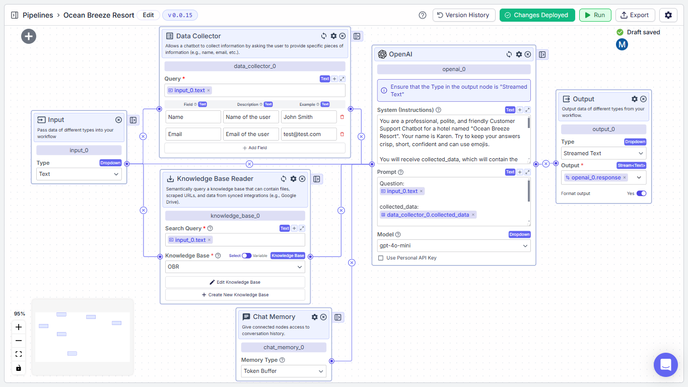
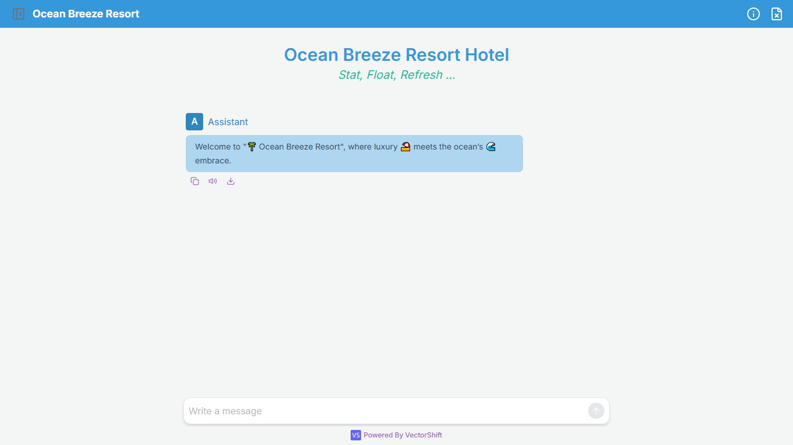

## Title: Lead Collecting Hotel RAG QnA ChatBot Implemented using VectorShift AI platform.

### Overview:
- The goal of the project is to implement a RAG Chatbot using No-Code/Low-Code AI platform such as VectorShift AI.
- App provides the interface for the users to interact with the systems.
- This app helps the businesses to collect the lead as Name and Email of the user.
- The chatbot answers the queries related only to the fake hotel named "Ocean Breeze Resort".
- This app has been implemented using memory as streamed chat.

### Access Link: 
- <a href="https://app.vectorshift.ai/chatbots/deployed/67c68c5d9c30f658199082ca" target="_blank"><b>[Online Link]</b></a>

### Dataset:
- PDF file (LLM Generated FAKE data for a hotel named Ocean Breeze Resort)

### Tech Stack:
- VectorShift AI platform

### Deployment: 
- Embedded Chatbot for a HTML web page in a website (Implemented for Demo Purpose)
- Web Page: "OBR_CB.html" <a href="OBR.html" target="_blank"><b>[Click to Open]</b></a>

### Screenshots:
>
*Workflow Pipeline*

>
*ChatBot UI*